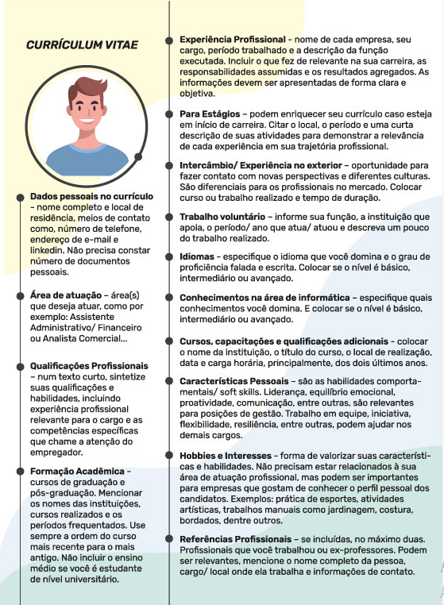
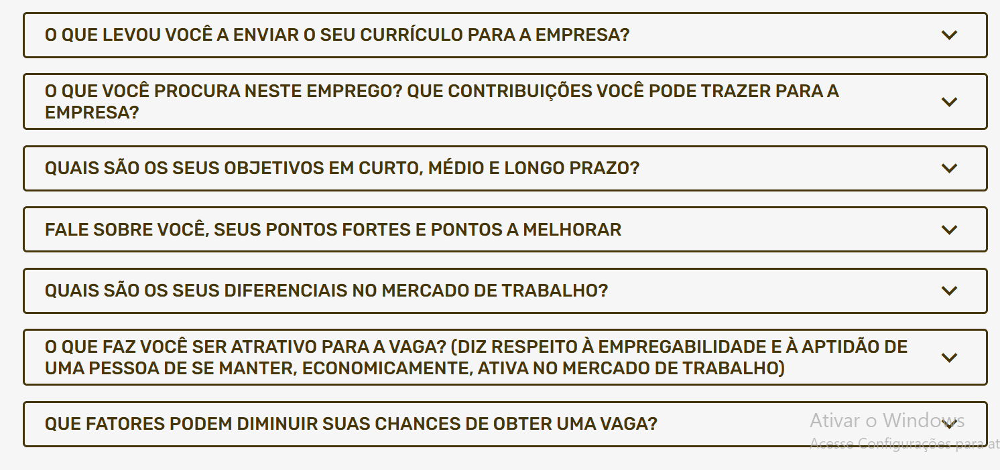

# Tema 7
# ALCANÇANDO O PRÓXIMO NÍVEL: PERSPECTIVAS PROFISSIONAIS E PROCESSOS SELETIVOS
Descubra como buscar consultorias e sites especializados para cadastrar seu currículo, transformando-o em uma ferramenta irresistível para os selecionadores. Aprenda a elaborar um currículo profissional que chame a atenção e a encontrar oportunidades incríveis no vasto mercado de trabalho.

Buscar consultorias e sites para cadastrar currículo.

Tranformando currículo em uma ferramenta irresistível para os selecionadores.

Elaborar um currículo profissional que chame atenção.

Encontrar oportunidades no mercado de trabalho.

## MINHAS METAS

- Preparar-se para as tendências do mercado de trabalho e futuros desafios impostos.
- Buscar consultorias e sites especializados para cadastrar o currículo para vagas de estágio e emprego. 
- Elaborar um currículo que desperte a atenção do selecionador para as vagas de trabalho.
- Encontrar boas oportunidades e espaços de atuação no mercado de trabalho.
- Criar um perfil profissional e marcar presença nas redes sociais. 
- Preparar-se para enfrentar as novas exigências no processo de seleção.
- Pesquisar os cuidados necessários para participar de uma entrevista de trabalho para impactar o selecionador.

Preprarar-se para as tendências do mercado de trabalho e futuro desafios impostos.

buscar consultorias e sites para cadastrar currículo para vaga de estágio e emprego

Elaborar um currículo que desperte a atenção do selecionador para as vagas de trabalho.

Encontrar boas oportundides e espaços de atuação no mercado de trabalho.

Criar um perfil profissional e mercar preseça nas redes sociais.

Preparar-se para enfrentar as novas exigÊnciaas no processo de seleção.

Pesquisar os cuidados pra participar de uma entrevista para imapctar o selecioandor.

## INICIE SUA JORNADA

Como você se percebe crescendo profissionalmente e desenvolvendo as suas competências?

Processo de recrutamento e seleção.

Os cuidados necessários e desafios enfrentados para o seu ingresso no mercado.

Os processos seletivos são estratégicos quando eles se realizam de forma a contratar e manter colaboradores que estejam comprometidos com o seu trabalho e com os objetivos organizacionais.

As vantagens de um processo seletivo eficaz se traduzem em melhor aproveitamento do potencial humano da empresa, motivação e engajamento por parte dos colaboradores em relação aos valores da empresa

Estamos vivendo tempos turbulentos, instáveis, com mudanças constantes e de avanço tecnológico. Dentro deste cenário, qual é a sua perspectiva de futuro? O que imagina que existe nele para você? Nesta perspectiva, só você consegue ver, e mais ninguém pode fazer isso no seu lugar. Vamos pensar a respeito?

Com dedicação, perseverança e o conhecimento que você irá adquirir com este tema, estará pronto para trilhar um caminho de sucesso na sua carreira profissional.

## PLAY NO CONHECIMENTO

Em tepos de turbulências, nesse cenário qual a perspectiva para o futuro? Imaginar o que desejar para o futuro. O ojetivo é desenvolver como profissional. A perspectiva é uma graduação, carreira, família. Diante da competitividade, as empresas buscam anidatos com copetências estratégicas. Por issoos processos seletivos estejam alinhados com a cultura organizacional. Mercado detrabalho está mais seletivo. Os processos seletivos passaram de operacionais apra estratégicos. Seleção por competência. Currículo é seu cartão de apresentação. Cuidados na entrevista de seleção: apresentarem-se bem, demonstrar interesse, prestar atenção no vestuáario, cuidarem da comunicação e liguagem não verbal, responder adequadamente com uma fala cometida sobre as expectativas da empresa. Sejam honestos, transparentes. Buscar atualizar sobre tendências do futuro do mercado. Currículo, presença nas redes sociais 

## MERCADO DE TRABALHO: TENDÊNCIAS E DESAFIOS PARA O FUTURO

Além de entender o que você quer para a sua vida futura, é importante, também, levar o cenário em consideração.

Por esse motivo, precisamos ponderar sobre o futuro do mercado de trabalho. 

Devido aos avanços tecnológicos das últimas décadas, o mercado de trabalho e a nossa relação com ele mudaram bastante. O mundo era muito mais previsível e controlado nas décadas de 1970 e 1980, com carreiras determinadas e um caminho hierárquico esperado, mas, desde que a internet surgiu, essa previsibilidade deixou de existir. Os anos 1990 e 2000 trouxeram mudanças significativas na maneira como o trabalho era feito, na oferta de profissionais, e trouxe, também, novos cargos e atribuições a serem desempenhados.

A partir dessas informações, seguem alguns questionamentos. Você está preparado para esse mercado que se apresenta? Como ajustar a sua perspectiva de futuro? Uma possível resposta é descobrir o que será valorizado nesse mercado futuro, pois estamos em plena vigência do lifelong learning, da era da “educação por toda a vida”.

É importante considerar que, no mercado de trabalho do futuro, alguns aspectos farão diferença, como o letramento digital e informacional e o diferencial humano.

Por isso, quando estiver avaliando a sua perspectiva de futuro, você pode ser o que quiser na sua carreira, desde que saiba navegar pelo digital e desenvolva algumas competências comportamentais como: liderança, trabalho em equipe, relacionamento interpessoal, criatividade, comunicação, empatia, iniciativa, resiliência, inteligência socioemocional, pensamento crítico, dentre outras.

O mercado de trabalho precisa de pessoas que se destacam, inquietas, proativas e que tomam atitudes para mudar as coisas.

A capacidade de enfrentar as mudanças constantes, a nossa mentalidade para lidar com os desafios da vida.

## PROCESSO DE RECRUTAMENTO DE PESSOAS

A globalização tem provocado transformações nas empresas, como o aumento da competitividade, a utilização de novas tecnologias, alterações no perfil dos profissionais a serem contratados, dentre outros. Assim, é necessário se adaptar para sobreviver a essa nova realidade. 

As mudanças nos cenários econômico, político, social e tecnológico trazem desafios na forma de gerir das empresas, portanto os modelos tradicionais de gestão de pessoas já não atendem mais às necessidades das organizações. A expectativa passa a ser de um profissional comprometido com os objetivos e estratégias organizacionais.

Os processos de recrutamento e seleção buscam aprimoramentos para identificar competências técnicas, habilidades e atitudes fundamentais nos candidatos. As competências são conjuntos de habilidades, conhecimentos, capacidades, características comportamentais e outros atributos que, na combinação correta e dentro das devidas circunstâncias, alcançam resultados desejados 

Para Rabaglio (2001), competência é um conjunto de conhecimentos, habilidades e comportamentos que permitem ao indivíduo desempenhar com eficácia determinadas tarefas em qualquer situação. O perfil de competências é o diferencial competitivo de cada pessoa ou profissional.

As vagas contendo diferentes requisitos, bem como as competências técnicas, comportamentos, conhecimentos e outros atributos necessários para ocupar determinada vaga.

## Conceito de recrutamento

Recrutamento de pessoas é um conjunto de procedimentos que visa atrair candidatos qualificados e capazes de ocupar cargos dentro da organização. O foco de um bom recrutamento precisa estar na qualidade e nas aptidões dos futuros colaboradores, o que pode ser avaliado a todo momento.

a utilização da tecnologia nos processos de recrutamento e seleção de pessoas possibilita uma abrangência maior na busca de candidatos, e de vários locais, os quais podem participar do mesmo processo. 

As empresas têm um universo de candidatos ampliado se comparado com métodos tradicionais, maior velocidade e amplitude nos processos de recrutamento quando automatizadas as fases, custos menores comparados com outras mídias, possibilidade de segmentar e selecionar candidatos por meio da atribuição de características, requisitos específicos e os candidatos com mais opções para buscar a vaga.

## Fontes de recrutamento

O selecionador vai decidir quais fontes utilizar de acordo com a complexidade, responsabilidades e competências técnicas e comportamentais do cargo a ser divulgado.

1. Seleção interna.
2. Indique um amigo.
3. Cartazes em lugares públicos.
4. SINE-Sistema Nacional Emprego.
5. Sindicatos.
6. Entidades associativas (SESI, SENAC, SENAI, SESC, SENAT etc.).
7. Escolas ensino técnico e universidades.
8. Anúncios em jornal, rádio etc.
9. Agências de empregos.
10. Consultorias Especializadas.
11. Internet e redes de relacionamento – LinkedIn.
12. WhatsApp corporativo para recebimento de currículos.

Após a divulgação da vaga e recebimento de currículos, é importante processar a análise dos interessados e fazer uma comparação entre o que é exigido pela vaga em aberto com as qualificações que constam no currículo. A entrega do currículo é apenas a primeira fase da admissão, as fases posteriores compreendem outras técnicas de seleção, que serão descritas posteriormente.

## COMO ELABORAR UM CURRÍCULO

Currículo é um documento conciso e organizado que resume as informações relevantes acerca da experiência educacional, profissional e habilidades de um indivíduo. Sua elaboração requer atenção devido a quatro motivos principais.

Primeiro, um currículo mal elaborado pode transmitir uma imagem negativa aos empregadores, afetando as chances de ser selecionado para entrevistas. Segundo, informações imprecisas ou falsas podem ser prejudiciais à confiança do candidato. Terceiro, a falta de foco no conteúdo pode resultar em um documento confuso e pouco atrativo. Por último, é crucial adaptar o currículo para cada candidatura, destacando as vagas mais relevantes para a posição desejada, já que um currículo genérico pode não chamar a atenção dos recrutadores de forma eficaz.

## ELABORANDO O CURRÍCULO

curriculum vitae (do latim "trajetória de vida"), ou apenas currículo, é um documento histórico que relata a trajetória educacional e as experiências profissionais de uma pessoa como forma de demonstrar suas habilidades e competências. De modo geral, ele pretende fornecer o perfil da pessoa para um empregador.

O currículo tem que causar uma primeira boa impressão com o profissional de seleção a ponto de ser convidado para as próximas etapas do processo de seleção. Este é o principal objetivo do currículo: lhe posicionar entre os candidatos mais interessantes para uma vaga de emprego. Ele deve ser objetivo e de fácil leitura, de preferência, de uma a duas páginas, no máximo.

A consistência das informações fornecidas, a clareza e a precisão na descrição dos resultados de trabalho, extensas descrições de instrução, lacunas cronológicas, profusão de dados pessoais são aspectos aos quais devemos estar atentos, pois todos podem ser indicadores importantes da trajetória profissional e pessoal dos candidatos. 

Para os especialistas, somente no caso de a empresa exigir, ou se for essencial para a vaga, recomenda-se que a foto seja atualizada e, de preferência, em formato 3x4. Outra questão é a pretensão salarial, fazer constar apenas se o anúncio solicitar, mas, antes de colocar, informe-se do salário aproximado praticado no mercado e, como sugestão, indique, entre parênteses, que é negociável.

## Construindo um currículo pelo Canva
Uma sugestão para se diferenciar é elaborar um currículo profissional, moderno e atraente por meio da plataforma Canva. Com o editor de currículos gratuito do Canva, você não precisa se preocupar com a formatação, é rápido e descomplicado se candidatar para o trabalho depois de criá-lo e personalizá-lo.

## Criação de um vídeo de apresentação para o processo seletivo

Isso se explica pela relação mais próxima e humana dos selecionadores com os candidatos, pois é possível expor competências de forma dinâmica e agir de maneira mais natural, o que é difícil de se analisar nos currículos on-line ou impressos.

Para gravar o seu vídeo de apresentação (em torno de dois minutos), é preciso escolher um local silencioso, claro, arejado e sem informações ao fundo, para que o foco seja você. Os ambientes barulhentos podem prejudicar a qualidade técnica, já que o áudio e a imagem de qualidade aprimoram o trabalho.

Ser espontâneo é um diferencial, a postura segura e firme mostra preparo emocional, uma soft skill muito importante e procurada pelas empresas. 

O que falar num vídeo de apresentação de trabalho? Inicie com as informações pessoais, fale sobre sua formação acadêmica e experiência profissional. Informe seus objetivos de carreira, competências e realizações, ressalte suas qualidades e algumas competências comportamentais importantes para o cargo em questão e escolha um projeto do qual sente orgulho. 

É possível contar também os motivos que o levaram a se inscrever na vaga, sendo necessário buscar saber quais são os valores daquela empresa que você deseja fazer parte e mostrar que os conhece. Você pode procurar essas informações no site ou nas redes sociais da organização. 

Faça um roteiro para lhe trazer mais confiança na transmissão das ideias. Leia, releia, grave e regrave até sentir que o vídeo está apto para ser enviado. Faça-o de forma que não pareça que você está lendo o seu currículo. Transforme esse texto numa conversa profissional, com leveza, simpatia e segurança.

## IDENTIFICANDO BOAS OPORTUNIDADES DE TRABALHO

aber identificar as oportunidades de trabalho é, sem dúvida, uma das principais características das pessoas que estão atentas às possibilidades ao seu redor, e que possam lhes oferecer chances de entrar no mercado de trabalho.

Conhecer o seu perfil profissional e objetivo de carreira é o início de qualquer estratégia para perseguir uma boa oportunidade profissional, além de acompanhar as tendências de mercado e se atualizar de forma constante.

## A importância do estágio na vida acadêmica

Cabe salientar a importância e alguns benefícios em relação ao estágio na vida dos estudantes para as suas formações pessoal e profissional. O estágio, seja ele obrigatório pelo curso que você escolheu fazer, seja remunerado ou sem remuneração, é o seu primeiro contato com o mercado de trabalho dentro da área de atuação escolhida e possibilita inúmeros aprendizados e realizações.

Essa experiência é uma importante aliada do curso de graduação, auxiliando no processo de crescimento e aprendizagem do aluno, fazendo com que você tenha contato com a sua área de atuação, na prática, e amplie seus conhecimentos acerca do que foi aprendido em sala de aula pelos docentes.

Possibilita ao estudante uma ótima oportunidade para aprimorar e/ou desenvolver novas habilidades e competências. Além disso, você fica conhecendo como funciona uma empresa, a rotina de profissionais experientes, pode facilitar a sua inserção no mercado de trabalho e se transformar em uma possibilidade futura de emprego.

## Fontes para encontrar oportunidades

É importante acompanhar o movimento do mercado de trabalho por meio de pesquisas e consultas periódicas, principalmente se está em busca de uma oportunidade.

1. LinkedIn - www.linkedin.com

Opção para manter um perfil profissional visível e ampliar sua rede de contatos. 

2. Meu Novo Trabalho - meunovotrabalho.me/

Site de emprego com vagas em diversos setores. 

3. Infojobs - www.infojobs.com.br

Site de vagas de empregos gratuito.

4. Empregos.com.br - www.empregos.com.br

Oferece serviço de assinatura para aumentar a visibilidade do perfil do candidato. 

5. Sine - www.sine.com.br

O Site Nacional de Empregos (Sine) é uma plataforma gratuita de classificados on-line de vagas de emprego. 

6. Vagas - www.vagas.com.br

É gratuito e tem como base uma ferramenta pensada na gestão de recrutamento e seleção, possibilitando ao candidato encontrar vagas. 

7. Indeed - www.indeed.com.br

Ferramenta capaz de buscar vagas para o perfil solicitado em diferentes sites de emprego ao mesmo tempo. É gratuito para candidatos. 

8. BNE - www.bne.com.br

Site gratuito de vagas de emprego em cargos diferentes.

9. Gupy - www.gupy.com.br

Plataforma de recrutamento e seleção.

10. CIEE - www.ciee.org.br

O site do Centro de Integração Empresa-Escola (CIEE) é gratuito. Ajuda os estudantes a encontrarem oportunidades de estágio no mercado de trabalho.

## LinkedIn: como criar e utilizar com eficácia

O LinkedIn é uma rede social profissional, foi criado em 2003 e era visto como “um site de currículos”. Hoje, o LinkedIn é a maior rede profissional do mundo, com mais de 500 milhões de usuários em aproximadamente 200 países.

Você pode seguir profissionais e empresas com os quais tem interesses em comum, seja para trabalhar, seja para buscar serviços. Adicione profissionais que você conhece, foque em pessoas do seu ramo e em empresas que gostaria de trabalhar, estudar ou ter algum tipo de negócio em conjunto. Seja educado e gentil e encontre uma forma assertiva de abordá-los.

## PROCESSO DE SELEÇÃO DE PESSOAS

Dando continuidade no processo de seleção de pessoas, como próximos passos, vamos discorrer sobre os diversos instrumentos e técnicas que podem ser utilizadas para identificar as competências comportamentais de cada candidato, como dinâmica de grupo ou entrevista coletiva (presencial ou on-line), aplicação de testes de conhecimentos e situacionais, redação para análise da escrita, entrevista comportamental com a presença do gestor de área e para cargos de gestão, a aplicação de testes psicológicos e/ou avaliação de perfil.

a seleção tem um desafio que é perceber se os valores do futuro colaborador são compatíveis com os valores e cultura organizacional”.

O processo de seleção no passado era focado nas competências técnicas, também chamadas de hard skills, que se traduzem em formação educacional, experiência na função e cursos técnicos relacionados à área em questão. Hoje, o processo de seleção é focado nas competências comportamentais, também chamadas de soft skills, as quais se referem às características pessoais compatíveis com as exigências do cargo e devem constar na descrição e análise de cada um dos cargos da organização.

## Técnicas e ferramentas do processo de seleção

O  selecionador vai decidir quais técnicas ou ferramentas utilizar de acordo com a complexidade, responsabilidades e competências técnicas e comportamentais do cargo a ser contratado.

Dinâmica de grupos e entrevista coletiva

A dinâmica de grupo e a entrevista coletiva são conduzidas pelo selecionador com a presença e observação do gestor requisitante da vaga. Também podem participar, com papéis definidos, alguns gerentes ou membros da equipe com os quais os candidatos, caso sejam selecionados, irão atuar (ALMEIDA, 2009). Nesta etapa, existe a oportunidade de apresentar o gestor do setor para os candidatos, e este, explicar detalhes acerca da vaga proposta.

A dinâmica de grupo é uma metodologia vivencial praticada para avaliar comportamentos específicos com base no mapa de competências (MC) do cargo e analisar a interação de cada candidato com os demais participantes, observando a conduta no grupo diante de determinadas situações. Mediante essa conduta, pode-se fazer a relação do perfil do candidato com as competências definidas para o cargo. 

Testes de conhecimentos e situacionais

Os testes de conhecimentos e situacionais buscam medi-lo referente à cultura ou competência requerida para a atuação na área em que poderá trabalhar. Carvalho, Passos e Saraiva (2008, p. 80) dizem que estes “são apresentados no formato de questionário, provas, atividades práticas ou, então, realizados oralmente”. 

Redação

A redação é uma ferramenta eficiente no processo seletivo. Conhecemos um pouco mais sobre o candidato tendo uma ideia da sua capacidade de se expressar, sua linha de raciocínio, sua visão de mundo, como organiza suas ideias e conduz sua argumentação, além do domínio da língua portuguesa

Entrevista comportamental

A entrevista comportamental permite aprofundar e esclarecer as informações, além de identificar as competências dos candidatos. Para Banov (2012), a entrevista baseada em competências é estruturada e situacional, e tem a elaboração das suas questões focada nas atitudes e no comportamento dos candidatos. Baseia-se na premissa de que a previsão do comportamento futuro de uma pessoa está relacionada ao comportamento dela no passado em ambientes similares. Deve-se buscar nas respostas qual é o padrão comportamental do candidato a partir das experiências passadas relatadas. 

Segundo Rabaglio (2001, p. 37), “ao investigar o comportamento do candidato, vamos conhecer o contexto em que aconteceu a ação, detalhes da ação tomada e o resultado alcançado por esta ação”. 

Assessment para mapeamento de perfil
A avaliação psicológica deve ser aplicada, necessariamente, por um psicólogo e ter como um dos objetivos identificar os traços no perfil de cada candidato durante os processos seletivos, a fim de viabilizar o mapeamento de competências e o comportamento adequado para a função determinada. 

A avaliação de perfil comportamental pode ser realizada por profissional com outra formação acadêmica, desde que tenha conhecimentos da condução e avaliação de perfil. É um questionário que identifica as competências de uma pessoa, agrupando-os de acordo com características comuns, em diferentes tipos de perfis. 

## 
TEMA DE APRENDIZAGEM
ALCANÇANDO O PRÓXIMO NÍVEL:
PERSPECTIVAS PROFISSIONAIS E PROCESSOS SELETIVOS
Filomena Regina Storti Mineto

MINHAS METAS
Preparar-se para as tendências do mercado de trabalho e futuros desafios impostos.
Buscar consultorias e sites especializados para cadastrar o currículo para vagas de estágio e emprego. 
Elaborar um currículo que desperte a atenção do selecionador para as vagas de trabalho.
Encontrar boas oportunidades e espaços de atuação no mercado de trabalho.
Criar um perfil profissional e marcar presença nas redes sociais. 
Preparar-se para enfrentar as novas exigências no processo de seleção.
Pesquisar os cuidados necessários para participar de uma entrevista de trabalho para impactar o selecionador.
Inicie sua Jornada
Olá, estudante, vamos iniciar este tema com uma importante reflexão sobre perspectivas profissionais futuras: como você se percebe crescendo profissionalmente e desenvolvendo as suas competências?

Convidamos você a agregar novos conhecimentos acerca do processo de recrutamento e seleção de pessoas e também dialogar sobre os cuidados necessários e desafios enfrentados para o seu ingresso no mercado de trabalho. 

Os processos seletivos são estratégicos quando eles se realizam de forma a contratar e manter colaboradores que estejam comprometidos com o seu trabalho e com os objetivos organizacionais. As vantagens de um processo seletivo eficaz se traduzem em melhor aproveitamento do potencial humano da empresa, motivação e engajamento por parte dos colaboradores em relação aos valores da empresa.

Estamos vivendo tempos turbulentos, instáveis, com mudanças constantes e de avanço tecnológico. Dentro deste cenário, qual é a sua perspectiva de futuro? O que imagina que existe nele para você? Nesta perspectiva, só você consegue ver, e mais ninguém pode fazer isso no seu lugar. Vamos pensar a respeito?

Em outras palavras, ter perspectiva de futuro é imaginar e desejar o que você quer para o seu futuro, para a sua vida adulta, sua carreira e vida pessoal, já que o seu objetivo é se desenvolver como ser humano e como profissional.

Se você ingressou em um curso de graduação, sua perspectiva pode estar voltada para conseguir seu diploma e construir uma carreira, ou em construir uma família e ter uma carreira que se adapte a isso. Independentemente do que você enxerga no seu futuro, a perspectiva lhe oferece objetivos e um senso de direção a serem conquistados. Então, vamos começar esta jornada juntos e explorar os passos necessários para alcançar a empregabilidade desejada. Este tema vai ajudá-lo a se destacar no mercado de trabalho, como uma pessoa preparada e confiante.

Com dedicação, perseverança e o conhecimento que você irá adquirir com este tema, estará pronto para trilhar um caminho de sucesso na sua carreira profissional.

PLAY NO CONHECIMENTO
Preparamos um podcast para você compreender melhor a importância de buscar se atualizar para as tendências do mercado de trabalho e futuros desafios que se impõem. Você acredita que está preparado para enfrentar as novas exigências no processo de seleção, quanto à elaboração de um currículo que desperte a atenção do selecionador, pela sua presença nas redes sociais profissionais e em relação aos cuidados necessários para participar de uma entrevista de trabalho para impactar resultados positivos nas suas trajetórias pessoal e profissional? Como você faz isso? Bora dar o play?

Conteúdo de áudio/vídeo não patrocinado. Esse recurso utilizará seu pacote de dados (ou wifi) para ser exibido.

Podcast em palavras
expand_more

Baixe o podcast em palavras
VAMOS RECORDAR

A seguir, um artigo sobre o profissional do futuro que tem sido uma das principais preocupações nos últimos anos. Sua leitura nos permite relembrar o cenário proposto para 2018 e para 2020 com relação ao profissional do futuro. Vem comigo! Leia o material na íntegra

MERCADO DE TRABALHO: TENDÊNCIAS E DESAFIOS PARA O FUTURO
Além de entender o que você quer para a sua vida futura, é importante, também, levar o cenário em consideração. Por esse motivo, precisamos ponderar sobre o futuro do mercado de trabalho. 

mas, desde que a internet surgiu, essa previsibilidade deixou de existir

Devido aos avanços tecnológicos das últimas décadas, o mercado de trabalho e a nossa relação com ele mudaram bastante. O mundo era muito mais previsível e controlado nas décadas de 1970 e 1980, com carreiras determinadas e um caminho hierárquico esperado, mas, desde que a internet surgiu, essa previsibilidade deixou de existir. Os anos 1990 e 2000 trouxeram mudanças significativas na maneira como o trabalho era feito, na oferta de profissionais, e trouxe, também, novos cargos e atribuições a serem desempenhados.

Existem profissões, hoje, com as quais profissionais não sonhavam há duas décadas, por exemplo, influenciadores digitais e produtores de conteúdo, dentre outras, e essas mudanças continuarão acontecendo no futuro. 

Então, podemos esperar que metade dos trabalhos que conhecemos hoje serão extintos até 2035 devido ao uso da inteligência artificial, o trabalho repetitivo e as tarefas operacionais serão extintos e surgirão novos desafios e oportunidades das profissões no século XXI diante dos avanços tecnológicos.

A partir dessas informações, seguem alguns questionamentos. Você está preparado para esse mercado que se apresenta? Como ajustar a sua perspectiva de futuro? Uma possível resposta é descobrir o que será valorizado nesse mercado futuro, pois estamos em plena vigência do lifelong learning, da era da “educação por toda a vida”.

Nesses novos tempos, em que viceja a “heutagogia”, termo usado desde o ano de 2000 para denominar a aprendizagem autodirecionada, a ênfase deve ser dada ao ensino continuado, buscando desenvolver a autonomia, a capacidade e as habilidades particulares do indivíduo em diferentes contextos de conhecimento, tendo como apoio, em especial, os docentes mentores.

É importante considerar que, no mercado de trabalho do futuro, alguns aspectos farão diferença, como o letramento digital e informacional e o diferencial humano. Por isso, quando estiver avaliando a sua perspectiva de futuro, você pode ser o que quiser na sua carreira, desde que saiba navegar pelo digital e desenvolva algumas competências comportamentais como: liderança, trabalho em equipe, relacionamento interpessoal, criatividade, comunicação, empatia, iniciativa, resiliência, inteligência socioemocional, pensamento crítico, dentre outras.

Segundo Zygmunt Bauman, autor do livro Tempos Líquidos, “vivemos em um solo instável e precisamos ser protagonistas porque a imprevisibilidade é muito grande”. O mercado de trabalho precisa de pessoas que se destacam, inquietas, proativas e que tomam atitudes para mudar as coisas. 

Outra questão a ser considerada é a necessidade de haver mudança do mindset, que é a capacidade de enfrentar as mudanças constantes, a nossa mentalidade para lidar com os desafios da vida, os quais, influenciados por nossas crenças e valores, nos levam a agir de determinada maneira, muitas vezes de forma inconsciente. 

Após a reflexão sobre o mercado de trabalho, as tendências e os desafios futuros, vamos, a seguir, abordar o processo de recrutamento e seleção de pessoas.

PROCESSO DE RECRUTAMENTO DE PESSOAS
A globalização tem provocado transformações nas empresas, como o aumento da competitividade, a utilização de novas tecnologias, alterações no perfil dos profissionais a serem contratados, dentre outros. Assim, é necessário se adaptar para sobreviver a essa nova realidade. 

As mudanças nos cenários econômico, político, social e tecnológico trazem desafios na forma de gerir das empresas, portanto os modelos tradicionais de gestão de pessoas já não atendem mais às necessidades das organizações. A expectativa passa a ser de um profissional comprometido com os objetivos e estratégias organizacionais.

A expectativa passa a ser de um profissional comprometido com os objetivos e estratégias organizacionais

Os processos de recrutamento e seleção buscam aprimoramentos para identificar competências técnicas, habilidades e atitudes fundamentais nos candidatos. As competências são conjuntos de habilidades, conhecimentos, capacidades, características comportamentais e outros atributos que, na combinação correta e dentro das devidas circunstâncias, alcançam resultados desejados (DELLAMORA; RODRIGUES, 2011).

Para Rabaglio (2001), competência é um conjunto de conhecimentos, habilidades e comportamentos que permitem ao indivíduo desempenhar com eficácia determinadas tarefas em qualquer situação. O perfil de competências é o diferencial competitivo de cada pessoa ou profissional.

Para Arboite (2008), as organizações, nos seus processos de recrutamento e seleção, normalmente, utilizam algum mapeamento de perfil para as vagas contendo diferentes requisitos, bem como as competências técnicas, comportamentos, conhecimentos e outros atributos necessários para ocupar determinada vaga.

Conceito de recrutamento
Recrutamento de pessoas é um conjunto de procedimentos que visa atrair candidatos qualificados e capazes de ocupar cargos dentro da organização. O foco de um bom recrutamento precisa estar na qualidade e nas aptidões dos futuros colaboradores, o que pode ser avaliado a todo momento.

Mediante um perfil bem definido do profissional a ser selecionado, definem-se, então, quais são as melhores formas de captação; interna, externa, mista, on-line ou híbrida (CHIAVENATO, 1999).

Recrutamento Interno
Recrutamento Externo
Recrutamento Misto
Recrutamento On-line
Recrutamento Híbrido
Aborda os colaboradores que trabalham na organização, oferecendo-lhes novas oportunidades.

Hoje, a utilização da tecnologia nos processos de recrutamento e seleção de pessoas possibilita uma abrangência maior na busca de candidatos, e de vários locais, os quais podem participar do mesmo processo. 

As empresas têm um universo de candidatos ampliado se comparado com métodos tradicionais, maior velocidade e amplitude nos processos de recrutamento quando automatizadas as fases, custos menores comparados com outras mídias, possibilidade de segmentar e selecionar candidatos por meio da atribuição de características, requisitos específicos e os candidatos com mais opções para buscar a vaga.

Fontes de recrutamento
O selecionador vai decidir quais fontes utilizar de acordo com a complexidade, responsabilidades e competências técnicas e comportamentais do cargo a ser divulgado.

Quadro 1 – Fontes de recrutamento

1. Seleção interna.

7. Escolas ensino técnico e universidades.

2. Indique um amigo.

8. Anúncios em jornal, rádio etc.

3. Cartazes em lugares públicos.

9. Agências de empregos.

4. SINE-Sistema Nacional Emprego.

10. Consultorias Especializadas.

5. Sindicatos.

11. Internet e redes de relacionamento – LinkedIn.

6. Entidades associativas (SESI, SENAC, SENAI, SESC, SENAT etc.).

12. WhatsApp corporativo para recebimento de currículos.

Fonte: a autora.

Após a divulgação da vaga e recebimento de currículos, é importante processar a análise dos interessados e fazer uma comparação entre o que é exigido pela vaga em aberto com as qualificações que constam no currículo. A entrega do currículo é apenas a primeira fase da admissão, as fases posteriores compreendem outras técnicas de seleção, que serão descritas posteriormente.

COMO ELABORAR UM CURRÍCULO
Currículo é um documento conciso e organizado que resume as informações relevantes acerca da experiência educacional, profissional e habilidades de um indivíduo. Sua elaboração requer atenção devido a quatro motivos principais. 

Primeiro, um currículo mal elaborado pode transmitir uma imagem negativa aos empregadores, afetando as chances de ser selecionado para entrevistas. Segundo, informações imprecisas ou falsas podem ser prejudiciais à confiança do candidato. Terceiro, a falta de foco no conteúdo pode resultar em um documento confuso e pouco atrativo. Por último, é crucial adaptar o currículo para cada candidatura, destacando as vagas mais relevantes para a posição desejada, já que um currículo genérico pode não chamar a atenção dos recrutadores de forma eficaz.

Elaborando o currículo
fornecer o perfil da pessoa para um empregador

O curriculum vitae (do latim "trajetória de vida"), ou apenas currículo, é um documento histórico que relata a trajetória educacional e as experiências profissionais de uma pessoa como forma de demonstrar suas habilidades e competências. De modo geral, ele pretende fornecer o perfil da pessoa para um empregador, sendo um documento crucial para conquistar um emprego.

O currículo tem que causar uma primeira boa impressão com o profissional de seleção a ponto de ser convidado para as próximas etapas do processo de seleção. Este é o principal objetivo do currículo: lhe posicionar entre os candidatos mais interessantes para uma vaga de emprego. Ele deve ser objetivo e de fácil leitura, de preferência, de uma a duas páginas, no máximo. Faissal et al. (2009, p. 87) relatam: 

A consistência das informações fornecidas, a clareza e a precisão na descrição dos resultados de trabalho, extensas descrições de instrução, lacunas cronológicas, profusão de dados pessoais são aspectos aos quais devemos estar atentos, pois todos podem ser indicadores importantes da trajetória profissional e pessoal dos candidatos. 

Uma dúvida dos candidatos ao emprego é saber se colocam a foto no currículo. Para os especialistas, somente no caso de a empresa exigir, ou se for essencial para a vaga, recomenda-se que a foto seja atualizada e, de preferência, em formato 3x4. Outra questão é a pretensão salarial, fazer constar apenas se o anúncio solicitar, mas, antes de colocar, informe-se do salário aproximado praticado no mercado e, como sugestão, indique, entre parênteses, que é negociável.

O que e como fazer constar as principais informações em um currículo profissional? Vamos aprender a elaborar um currículo mais atraente para os recrutadores?

Se for o seu primeiro emprego, utilizar o item “Experiência profissional” para falar de atividades similares a trabalho, como experiências vividas na universidade, estágios ou trabalho voluntariado. Procure descrever quais foram as suas responsabilidades em cada uma delas e o tempo que duraram.

O importante é não perder a sua motivação. Diversas vagas de trabalho buscam profissionais novos e sem experiência anterior no mercado, desde que se apresentem com boa vontade, disciplina e disposição para aprender e crescer dentro da organização.

Construindo um currículo pelo Canva
Uma sugestão para se diferenciar é elaborar um currículo profissional, moderno e atraente por meio da plataforma Canva. Com o editor de currículos gratuito do Canva, você não precisa se preocupar com a formatação, é rápido e descomplicado se candidatar para o trabalho depois de criá-lo e personalizá-lo.

Acesse o Canva ou abra o app e faça login ou se registre para criar uma nova conta. Busque “currículos” para começar a criá-lo e selecione o seu modelo de currículo preferido, dentre dezenas de opções feitas por designers profissionais (https://www.canva.com/).

Criação de um vídeo de apresentação para o processo seletivo
Os vídeos de apresentação são bem-vindos. Isso se explica pela relação mais próxima e humana dos selecionadores com os candidatos, pois é possível expor competências de forma dinâmica e agir de maneira mais natural, o que é difícil de se analisar nos currículos on-line ou impressos.

Para gravar o seu vídeo de apresentação (em torno de dois minutos), é preciso escolher um local silencioso, claro, arejado e sem informações ao fundo, para que o foco seja você. Os ambientes barulhentos podem prejudicar a qualidade técnica, já que o áudio e a imagem de qualidade aprimoram o trabalho.

Ser espontâneo é um diferencial, a postura segura e firme mostra preparo emocional, uma soft skill muito importante e procurada pelas empresas. 

O que falar num vídeo de apresentação de trabalho? Inicie com as informações pessoais, fale sobre sua formação acadêmica e experiência profissional. Informe seus objetivos de carreira, competências e realizações, ressalte suas qualidades e algumas competências comportamentais importantes para o cargo em questão e escolha um projeto do qual sente orgulho. 

É possível contar também os motivos que o levaram a se inscrever na vaga, sendo necessário buscar saber quais são os valores daquela empresa que você deseja fazer parte e mostrar que os conhece. Você pode procurar essas informações no site ou nas redes sociais da organização. 

É essencial que o candidato use uma linguagem clara, objetiva e autêntica, sem cometer erros de português e nem gírias. Mantenha a naturalidade, use roupas discretas. Para mulheres, uma maquiagem leve, e para homens, cabelos e barba arrumados. Isso transmite ao selecionador uma imagem de profissionalismo.

Faça um roteiro para lhe trazer mais confiança na transmissão das ideias. Leia, releia, grave e regrave até sentir que o vídeo está apto para ser enviado. Faça-o de forma que não pareça que você está lendo o seu currículo. Transforme esse texto numa conversa profissional, com leveza, simpatia e segurança.

EU INDICO
A seguir, entenda como fazer um vídeo de apresentação quando a empresa solicitar. Inspire-se a criar o seu vídeo de apresentação. 

Conteúdo de áudio/vídeo não patrocinado. Esse recurso utilizará seu pacote de dados (ou wifi) para ser exibido.

IDENTIFICANDO BOAS OPORTUNIDADES DE TRABALHO
Saber identificar as oportunidades de trabalho é, sem dúvida, uma das principais características das pessoas que estão atentas às possibilidades ao seu redor, e que possam lhes oferecer chances de entrar no mercado de trabalho. Conhecer o seu perfil profissional e objetivo de carreira é o início de qualquer estratégia para perseguir uma boa oportunidade profissional, além de acompanhar as tendências de mercado e se atualizar de forma constante.

A importância do estágio na vida acadêmica
Cabe salientar a importância e alguns benefícios em relação ao estágio na vida dos estudantes para as suas formações pessoal e profissional. O estágio, seja ele obrigatório pelo curso que você escolheu fazer, seja remunerado ou sem remuneração, é o seu primeiro contato com o mercado de trabalho dentro da área de atuação escolhida e possibilita inúmeros aprendizados e realizações.

Essa experiência é uma importante aliada do curso de graduação, auxiliando no processo de crescimento e aprendizagem do aluno, fazendo com que você tenha contato com a sua área de atuação, na prática, e amplie seus conhecimentos acerca do que foi aprendido em sala de aula pelos docentes.

Possibilita ao estudante uma ótima oportunidade para aprimorar e/ou desenvolver novas habilidades e competências. Além disso, você fica conhecendo como funciona uma empresa, a rotina de profissionais experientes, pode facilitar a sua inserção no mercado de trabalho e se transformar em uma possibilidade futura de emprego.

O estágio se apresenta como uma extensão do aprendizado do aluno e não deve configurar vínculo empregatício com a empresa que o oferece. O estagiário pode receber benefícios, com direitos protegidos por lei como vale-transporte, vale-refeição, seguro saúde, auxílio educação, dentre outros a definir pela empresa, o que não se configura numa prática comum.

INDICAÇÃO DE FILME
Um Senhor Estagiário
Começar um novo emprego pode ser um grande desafio, especialmente para alguém aposentado. Tentando voltar ao mercado de trabalho, o viúvo Ben Whittaker, de 70 anos, aproveita a oportunidade para se tornar um estagiário sênior em um site de moda. Ben logo se torna popular entre seus colegas de trabalho mais jovens, incluindo Jules Ostin, a chefe e fundadora da empresa. O charme, a sabedoria e o senso de humor de Whittaker o ajudam a desenvolver um vínculo especial e uma bela amizade com Jules.

Um filme bem-humorado que retrata a saga de um Sr. estagiário em busca de uma oportunidade de trabalho no mercado. Assista ao filme e agregue conhecimentos e aprendizados importantes sobre a questão.

A importância do trabalho voluntário e atividades de extensão na vida acadêmica
Vamos pensar na importância do trabalho voluntário no currículo do aluno? É essencial para mostrar que o candidato possui habilidades diferenciadas dos demais e pode ser capaz de melhorar o companheirismo entre as pessoas da sua convivência pessoal e no trabalho. As empresas valorizam os talentos com interesse social, que colaboram para causas relevantes.

A pergunta é: o trabalho voluntário pode influenciar na contratação de um profissional em uma empresa? Os empregadores consideram essas atividades de muito valor, pois entendem que a exposição a diferentes ambientes e práticas de trabalho tem aplicação e reflexo dentro da empresa, e oferece a chance de se ganhar novas experiências e habilidades em um ambiente de trabalho. 

demonstra que você está apto a realizar diferentes funções com vontade, disciplina e determinação

O trabalho voluntário e a extensão acadêmica não possuem remuneração, mas permitem conhecer outras pessoas, profissões e novos contextos, usar a sua criatividade e força de vontade para resolver problemas, adquirir humildade em relação à hierarquia e demonstram que você está apto a realizar diferentes funções com vontade, disciplina e determinação.

Mostram que você se preocupa com o próximo e ajuda na construção de uma sociedade mais justa e solidária. Possibilitam exercer seu papel de cidadão e viver novas experiências, compartilhar amor, acolhimento e respeito com as pessoas que vão cruzar o seu caminho. Indicam responsabilidade, sociabilidade, aumentam o círculo social e o seu networking. O ganho e o aprendizado maior do serviço voluntário são para quem doa, e não para quem recebe, trazem a sensação de gratidão e ajudam a ressignificar o conceito de felicidade.

Fontes para encontrar oportunidades
A seguir, conheceremos algumas fontes e sites que podem nos apresentar boas oportunidades de trabalho, seja para quem está disponível no mercado em busca de um trabalho, seja para quem está em atividade. É importante acompanhar o movimento do mercado de trabalho por meio de pesquisas e consultas periódicas, principalmente se está em busca de uma oportunidade.

Quadro 3 – Agências e sites de emprego

1. LinkedIn - www.linkedin.com

Opção para manter um perfil profissional visível e ampliar sua rede de contatos. 

2. Meu Novo Trabalho - meunovotrabalho.me/

Site de emprego com vagas em diversos setores. 

3. Infojobs - www.infojobs.com.br

Site de vagas de empregos gratuito.

4. Empregos.com.br - www.empregos.com.br

Oferece serviço de assinatura para aumentar a visibilidade do perfil do candidato. 

5. Sine - www.sine.com.br

O Site Nacional de Empregos (Sine) é uma plataforma gratuita de classificados on-line de vagas de emprego. 

6. Vagas - www.vagas.com.br

É gratuito e tem como base uma ferramenta pensada na gestão de recrutamento e seleção, possibilitando ao candidato encontrar vagas. 

7. Indeed - www.indeed.com.br

Ferramenta capaz de buscar vagas para o perfil solicitado em diferentes sites de emprego ao mesmo tempo. É gratuito para candidatos. 

8. BNE - www.bne.com.br

Site gratuito de vagas de emprego em cargos diferentes.

9. Gupy - www.gupy.com.br

Plataforma de recrutamento e seleção.

10. CIEE - www.ciee.org.br

O site do Centro de Integração Empresa-Escola (CIEE) é gratuito. Ajuda os estudantes a encontrarem oportunidades de estágio no mercado de trabalho.

Fonte: a autora.

É importante mantermos uma boa rede de contatos permanentemente ativa. É por essa prática que um profissional faz com que seu nome fique conhecido no meio. E com um networking bem alimentado, com a convivência e o apoio de pessoas, é possível manter e fazer novos contatos, se atualizar em relação ao mercado, abrir portas e gerar novas oportunidades de trabalho. 

É por essa prática que um profissional faz com que seu nome fique conhecido no meio

LinkedIn: como criar e utilizar com eficácia
O LinkedIn é uma rede social profissional, foi criado em 2003 e era visto como “um site de currículos”. Hoje, o LinkedIn é a maior rede profissional do mundo, com mais de 500 milhões de usuários em aproximadamente 200 países.

Você pode seguir profissionais e empresas com os quais tem interesses em comum, seja para trabalhar, seja para buscar serviços. Adicione profissionais que você conhece, foque em pessoas do seu ramo e em empresas que gostaria de trabalhar, estudar ou ter algum tipo de negócio em conjunto. Seja educado e gentil e encontre uma forma assertiva de abordá-los.

Independentemente do seu momento profissional, seja colocado no mercado ou procurando oportunidades de trabalho ou estágio, mantenha sua rede de contatos aquecida, faça novas conexões, participe de grupos e troque informações. Hoje, muitos recrutadores buscam candidatos no LinkedIn.

Seguir e se conectar a profissionais e empresas, atualizar o seu currículo com as informações necessárias, procurar vagas, inspirar-se com conteúdo de diferentes profissionais, despertar o interesse de outras organizações, investir no seu marketing pessoal digital impulsionando a sua carreira, participar de grupos que possam enriquecer seu trabalho e pedir recomendações a colegas de trabalho para valorizar o seu perfil.

As suas interações no LinkedIn podem influenciar sua carreira de forma positiva ou negativa. A própria rede social recomenda cuidados, como escolher uma foto adequada, evitar erros de português, deixar os clichês e as piadas de lado e não enviar convites sem critério a desconhecidos. Orienta-se fazer bom uso das redes sociais e profissionais.

Ao finalizar este tema, você terá o desafio de abrir uma conta no LinkedIn, preencher os dados solicitados e atualizar o seu currículo.

PROCESSO DE SELEÇÃO DE PESSOAS
Dando continuidade no processo de seleção de pessoas, como próximos passos, vamos discorrer sobre os diversos instrumentos e técnicas que podem ser utilizadas para identificar as competências comportamentais de cada candidato, como dinâmica de grupo ou entrevista coletiva (presencial ou on-line), aplicação de testes de conhecimentos e situacionais, redação para análise da escrita, entrevista comportamental com a presença do gestor de área e para cargos de gestão, a aplicação de testes psicológicos e/ou avaliação de perfil.

Conceito de seleção
Leme (2009, p. 5) comenta que “a seleção tem um desafio que é perceber se os valores do futuro colaborador são compatíveis com os valores e cultura organizacional”. É escolher os candidatos mais adequados às necessidades do cargo, da gestão imediata e da organização. É um processo complexo que exige conhecimento, planejamento e reflexão.

O processo de seleção no passado era focado nas competências técnicas, também chamadas de hard skills, que se traduzem em formação educacional, experiência na função e cursos técnicos relacionados à área em questão. Hoje, o processo de seleção é focado nas competências comportamentais, também chamadas de soft skills, as quais se referem às características pessoais compatíveis com as exigências do cargo e devem constar na descrição e análise de cada um dos cargos da organização.

Técnicas e ferramentas do processo de seleção
O selecionador vai decidir quais técnicas ou ferramentas utilizar de acordo com a complexidade, responsabilidades e competências técnicas e comportamentais do cargo a ser contratado.

Dinâmica de grupos e entrevista coletiva
A dinâmica de grupo e a entrevista coletiva são conduzidas pelo selecionador com a presença e observação do gestor requisitante da vaga. Também podem participar, com papéis definidos, alguns gerentes ou membros da equipe com os quais os candidatos, caso sejam selecionados, irão atuar (ALMEIDA, 2009). Nesta etapa, existe a oportunidade de apresentar o gestor do setor para os candidatos, e este, explicar detalhes acerca da vaga proposta.

Item 1.1 A dinâmica de grupo é uma metodologia vivencial praticada para avaliar comportamentos específicos com base no mapa de competências (MC) do cargo e analisar a interação de cada candidato com os demais participantes, observando a conduta no grupo diante de determinadas situações. Mediante essa conduta, pode-se fazer a relação do perfil do candidato com as competências definidas para o cargo. Almeida (2009, p. 117) relata que “a dinâmica de grupo é uma ferramenta que pode oferecer informações valiosas sobre o perfil dos candidatos, principalmente no que se refere às competências atitudinais ou comportamentais”. Para utilizar uma das metodologias no processo de seleção, dinâmica de grupo ou entrevista coletiva, vai depender da formação acadêmica e experiência do profissional de seleção que vai conduzir o processo.

Testes de conhecimentos e situacionais
Os testes de conhecimentos e situacionais buscam medi-lo referente à cultura ou competência requerida para a atuação na área em que poderá trabalhar. Carvalho, Passos e Saraiva (2008, p. 80) dizem que estes “são apresentados no formato de questionário, provas, atividades práticas ou, então, realizados oralmente”. 

Redação

A redação é uma ferramenta eficiente no processo seletivo. Conhecemos um pouco mais sobre o candidato tendo uma ideia da sua capacidade de se expressar, sua linha de raciocínio, sua visão de mundo, como organiza suas ideias e conduz sua argumentação, além do domínio da língua portuguesa

Entrevista comportamental
A entrevista comportamental permite aprofundar e esclarecer as informações, além de identificar as competências dos candidatos. Para Banov (2012), a entrevista baseada em competências é estruturada e situacional, e tem a elaboração das suas questões focada nas atitudes e no comportamento dos candidatos. Baseia-se na premissa de que a previsão do comportamento futuro de uma pessoa está relacionada ao comportamento dela no passado em ambientes similares. Deve-se buscar nas respostas qual é o padrão comportamental do candidato a partir das experiências passadas relatadas. 

Item 3.1 As perguntas devem ser abertas, e não de múltipla escolha. Destacar o comportamento e enfatizar uma vivência do candidato, e não do seu grupo de trabalho. Segundo Rabaglio (2001, p. 37), “ao investigar o comportamento do candidato, vamos conhecer o contexto em que aconteceu a ação, detalhes da ação tomada e o resultado alcançado por esta ação”. Somente após identificar esses três itens na resposta do candidato (CAR), pode-se perceber suas competências. Pode-se utilizar o modelo de entrevista on-line via plataforma de chamada de vídeo, dependendo da etapa do processo de seleção e o local onde mora o candidato. Tem sido uma tendência em processos de R&S pela comodidade, rapidez e custos. A gravação de algumas entrevistas precisa ser aprovada pelos candidatos, e pode ser utilizada em apresentações futuras para os gestores que, porventura, não puderam participar dela.

chevron_left
radio_button_unchecked
radio_button_unchecked
radio_button_unchecked
radio_button_checked
chevron_right
Assessment para mapeamento de perfil
A avaliação psicológica deve ser aplicada, necessariamente, por um psicólogo e ter como um dos objetivos identificar os traços no perfil de cada candidato durante os processos seletivos, a fim de viabilizar o mapeamento de competências e o comportamento adequado para a função determinada. 

A avaliação de perfil comportamental pode ser realizada por profissional com outra formação acadêmica, desde que tenha conhecimentos da condução e avaliação de perfil. É um questionário que identifica as competências de uma pessoa, agrupando-os de acordo com características comuns, em diferentes tipos de perfis. 

Todas as etapas anteriormente citadas podem ser feitas de forma presencial, on-line ou híbrida (presencial e on-line). Posteriormente, o selecionador informa o parecer final ao gestor da área para poderem trocar feedbacks a respeito.

Assim que definido o candidato selecionado, é comum as empresas buscarem informações dele nas redes sociais acerca do comportamento que apresenta, como complemento do processo. No processo admissional, é importante que seja dado o retorno positivo ou negativo aos participantes e o parecer sobre o desempenho de cada um é cadastrado em um sistema para uma possível seleção futura. 

Faissal et al. (2009) destacam que a decisão de contratar não pertence ao selecionador ou à área de Gestão de Pessoas, mas, sim, ao gestor requisitante da vaga, pois é com ele que vai trabalhar. Essa decisão pode ou não coincidir com a opinião da área de Gestão de Pessoas. Se o gestor teve uma participação efetiva no processo seletivo, terá mais condições para decidir.

Da mesma forma que os candidatos a uma vaga precisam estar preparados e atentos a uma série de detalhes, um bom profissional no exercício do processo de recrutamento e seleção também necessita de preparo e atenção para poder identificar, avaliar e tomar a melhor decisão sobre os candidatos. 

Considerando a importância da preparação e conduta do selecionador no processo de contratação e como isso acaba por influenciar nas decisões, apresentamos, a seguir, algumas características que devem fazer parte do perfil daqueles que estão à frente de processos de recrutamento e seleção, sendo:

Habilidade de comunicação
Empatia e sensibilidade
Conhecimento técnico
Capacidade de avaliação
Ética profissional e imparcialidade
Recrutadores e selecionados devem ter excelente habilidade de comunicação, tanto verbal quanto escrita. Eles precisam se comunicar eficazmente com candidatos, gestores e colegas de trabalho, além de serem capazes de elaborar relatórios claros e concisos.

Além dessas características, a adaptabilidade, a capacidade de trabalhar sob pressão, a criatividade na busca de talentos e a habilidade de se manter atualizado com as tendências do mercado de trabalho também são qualidades valorizadas em profissionais que atuam em processos de recrutamento e seleção. 

É importante que o selecionador tenha habilidade para escolher os instrumentos de seleção mais adequados para a vaga. É imprescindível saber elaborar e fazer entrevistas, aplicar testes e dinâmicas de grupo, elaborar laudos com os pareceres dos candidatos, trabalhar em conjunto com o requisitante do cargo e ter uma comunicação clara com todos. 

Selecionar um profissional errado para a empresa envolve muitos custos, como o valor da rescisão, investimento em capacitações, desgaste e impacto no clima organizacional, dentre outras perdas.

Os cuidados a serem tomados pelos selecionadores nas diferentes etapas do processo de seleção são os mesmos exigidos dos candidatos às vagas, ou seja, ser pontual, manter a formalidade na comunicação, interagir com os candidatos, manter-se focado na atividade, evitar ser interrompido, estar apresentável e bem-arrumado.

## ENTREVISTA DE EMPREGO E ESTRATÉGIAS PARA ALCANÇAR O PRÓXIMO NÍVEL

a entrevista é a técnica mais utilizada em todas as organizações, independentemente do seu porte, e tem inúmeras aplicações, desde uma entrevista preliminar para o recrutamento, entrevista de seleção, de desempenho, até a entrevista de desligamento, a qual poderá ser subsídio para as políticas na área de recursos humanos das organizações. 

As entrevistas podem ser estruturadas (fechadas), compostas de perguntas definidas, ou semiestruturadas (abertas), concedendo maior liberdade ao selecionador de perguntar mediante o material trazido pelos candidatos.

## Como se preparar e se comportar durante a entrevista de trabalho

A entrevista é fator determinante para a obtenção da vaga. Tem a finalidade de confirmar aspectos levantados anteriormente, para clarear pontos que tenham apresentado dúvidas. Os dados são integrados por meio dos diversos instrumentos de seleção que foram utilizados, compondo-se um perfil do candidato como um todo.

E o entrevistador estará sempre atento a elementos da comunicação não verbal, tais como: o andar e a postura corporal do entrevistado, suas expressões faciais, aspectos psicomotores, gestos dos braços e das mãos, posição das pernas e dos pés, atitudes, tiques nervosos e gírias.

- Converse com pessoas que trabalham na empresa e coloque o seu posicionamento de forma profissional e com conhecimentos. Verifique o site, pesquise a empresa, tenha acesso à missão, visão e valores da organização.

- Desenvolvimento pessoal e profissional, novos desafios de aprendizado, contribuição para o crescimento e sucesso da sua empresa etc.

- Seja específico e tente aproximar os seus objetivos aos da empresa. A empresa pode verificar e analisar competências que sejam diferenciais no mercado de trabalho e para o cargo em questão.

- Essa pergunta é quase obrigatória. Dê uma resposta objetiva e que valorize o seu perfil profissional. Cuidado com as suas respostas.

- Qualificar-se na sua área de atuação, desenvolver competências técnicas e comportamentais necessárias ao mercado, domínio de outro idioma como inglês e espanhol, bons conhecimentos na área de informática enquanto estudante, buscar estágios na área que pretende se especializar, ler bastante (o que melhora a comunicação oral e escrita), ampliar o networking e a sua rede de relacionamento e buscar aperfeiçoamento constante.

- Desenvolver competências como: liderança, trabalho em equipe, comunicação, relacionamento interpessoal, equilíbrio emocional, resiliência, flexibilidade, ética profissional, dentre outras.

- Ausência de um projeto profissional/pessoal, falta de orientação para resultados (metas), sem iniciativa para inovar, falta de automotivação, carreira gerenciada pela empresa e não por você ou desenvolvida em empresas sem referência, ser espectador ao invés de realizador/protagonista e relacionamento (network) ilimitado.

